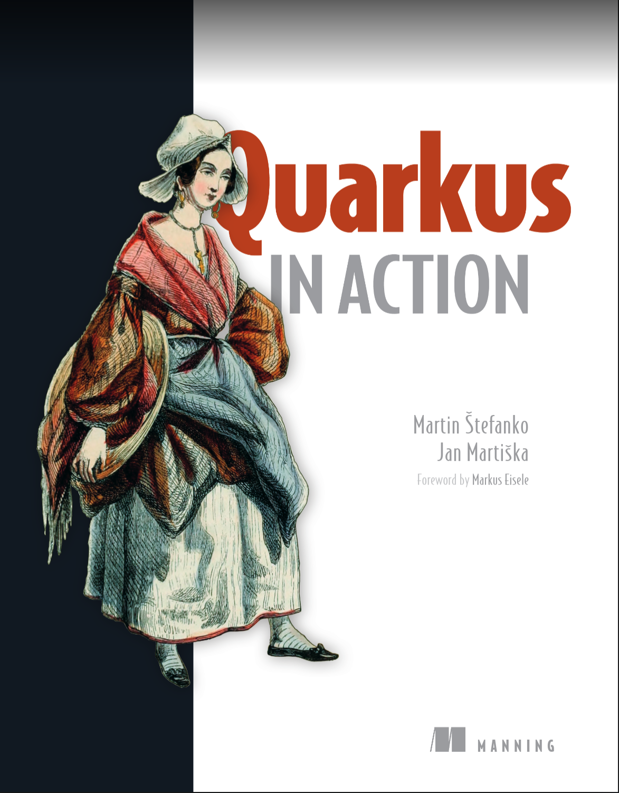
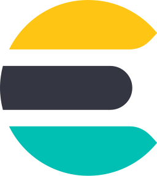
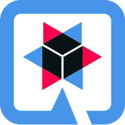
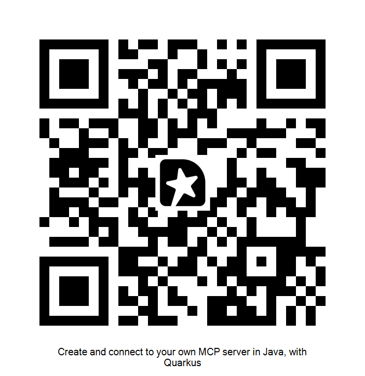

<!-- .slide: data-background-color="#FFFFFF" -->

#  Create and connect to your own MCP server in Java, with Quarkus

*Let your AI-infused application use tools written in Java!*

<br>

**Jan Martiška**, Quarkus Engineer at IBM

Note: !!!Speaker notes go here. They are visible in the presenter view (press S).

---
## About me
<ul>
    <li>Quarkus Engineer at IBM, formerly Red Hat</li>
    <li>Author of the Quarkus MCP client library (langchain4j)
    <li>Quarkus contributions: mostly AI stuff, GraphQL</li>
    <li>Also, CVE patches and LTS release coordination</li>
    <li>Co-author of Quarkus in Action (next slide...)</li>
</ul>

---
## Quarkus in Action

<div style="display: flex; align-items: center; justify-content: center; gap: 40px;">
  
  <div style="text-align: center;">
    <p>Use the QR code for 10% off</p>
    
  </div>
</div>

---
## Talk structure
Chapter 1: brief intro about MCP, Quarkus and LangChain4j

Chapter 2: building an MCP server with Quarkus

Chapter 3: connecting an AI-infused Quarkus application to your MCP server

---
<!-- .slide: data-background-color="#4595EB" -->
## Chapter 1: Brief intro about MCP, Quarkus and LangChain4j

---
## Model Context Protocol
<ul>
<li>Open-source standard for connecting AI applications to external systems.</li>
<li>Current version: 2025-11-25</li>
<li>New spec version coming soon, a significant (and incompatible) rework that makes servers stateless (initialization phase removed)</li>
</ul>

---
## Quarkus MCP server support

<ul>
    <li>The Quarkus MCP server extension: <a href="https://github.com/quarkiverse/quarkus-mcp-server">https://github.com/quarkiverse/quarkus-mcp-server</a> </li>
    <li>Supported transports: STDIO, Streamable HTTP, SSE (legacy), WebSocket (experimental)</li>
    <li>Now also part of the enterprise supported product (IBM Enterprise Build of Quarkus)</li>
</ul>

---
## Quarkus MCP client support
<ul>
    <li>Lives in the LangChain4j project (<a href="https://github.com/langchain4j/langchain4j">https://github.com/langchain4j/langchain4j</a>), see next slide</li>
    <li>Supported transports: STDIO, Streamable HTTP, SSE (legacy), WebSocket (experimental)</li>
    <li>Now also part of the enterprise supported product (IBM Enterprise Build of Quarkus)</li>
</ul>

---
## LangChain4j
<ul>
    <li>General Java-based toolkit for infusing your apps with AI</li>
    <li>Connecting to all major AI model providers</li>
    <li>RAG (Retrieval-augmented generation) pipelines
    <li>Agentic module for building autonomous agents performing complex workflows</li>
    <li>Guardrails for additional security (validation of LLM inputs, outputs, tool invocations)</li>
    <li>Tool calling over MCP and locally implemented (in-app)</li>
    <li>Persistent chat memory storage and management</li>
</ul>

---
## Supported LLM providers

<div class="icon-grid">
  <div class="icon-grid-item"><span>OpenAI</span></div>
  <div class="icon-grid-item"><span>Anthropic</span></div>
  <div class="icon-grid-item"><span>Google Gemini</span></div>
  <div class="icon-grid-item"><span>Vertex AI</span></div>
  <div class="icon-grid-item"><span>Amazon Bedrock</span></div>
  <div class="icon-grid-item"><span>Azure OpenAI</span></div>
  <div class="icon-grid-item"><span>Mistral AI</span></div>
  <div class="icon-grid-item"><span>Ollama</span></div>
  <div class="icon-grid-item"><span>Hugging Face</span></div>
  <div class="icon-grid-item"><span>watsonx.ai</span></div>
  <div class="icon-grid-item"><span>Cloudflare Workers AI</span></div>
  <div class="icon-grid-item"><span>OCI GenAI</span></div>
  <div class="icon-grid-item"><span>GitHub Models</span></div>
</div>
<p style="text-align:center; font-size:0.5em; color:#888; margin-top:10px;">+ Cohere, Jlama, DashScope (Qwen), ChatGLM, Qianfan, ZhiPu AI, Xinference, LocalAI, and more</p>

---
## Supported embedding stores

<div class="icon-grid">
  <div class="icon-grid-item"><span>PGVector</span></div>
  <div class="icon-grid-item"><span>Elasticsearch</span></div>
  <div class="icon-grid-item"><span>Redis</span></div>
  <div class="icon-grid-item"><span>MongoDB Atlas</span></div>
  <div class="icon-grid-item"><span>Neo4j</span></div>
  <div class="icon-grid-item"><span>Qdrant</span></div>
  <div class="icon-grid-item"><span>Milvus</span></div>
  <div class="icon-grid-item"><span>OpenSearch</span></div>
  <div class="icon-grid-item"><span>Cassandra</span></div>
  <div class="icon-grid-item"><span>Oracle</span></div>
  <div class="icon-grid-item"><span>Azure AI Search</span></div>
  <div class="icon-grid-item"><span>MariaDB</span></div>
  <div class="icon-grid-item"><span>Couchbase</span></div>
  <div class="icon-grid-item"><span>ClickHouse</span></div>
  <div class="icon-grid-item"><span>DuckDB</span></div>
  <div class="icon-grid-item"><span>S3 Vectors</span></div>
  <div class="icon-grid-item"><span>AlloyDB</span></div>
</div>
<p style="text-align:center; font-size:0.5em; color:#888; margin-top:10px;">+ Pinecone, Weaviate, Chroma, Infinispan, Vespa, Hibernate, In-memory, and more (37 total)</p>

---
## Feature support matrix

<table>
    <th><td>Quarkus MCP Client</td><td>Quarkus MCP Server</td></th>
    <tr>
        <td>Tools</td>
        <td></td>
        <td></td>
    </tr>
    <tr>
        <td>Resources</td>
        <td></td>
        <td></td>
    </tr>
    <tr>
        <td>Prompts</td>
        <td></td>
        <td></td>
    </tr>
    <tr>
        <td>Roots</td>
        <td></td>
        <td></td>
    </tr>
    <tr>
        <td>Progress notifications</td>
        <td></td>
        <td></td>
    </tr>
    <tr>
        <td>Sampling and elicitation</td>
        <td></td>
        <td></td>
    </tr>
    <tr>
        <td>Log messages (over the protocol)</td>
        <td></td>
        <td></td>
    </tr>
    <tr>
        <td>Long-running tasks</td>
        <td></td>
        <td></td>
    </tr>

</table>

---
<!-- .slide: data-background-color="#4595EB" -->
## Chapter 2: Building an MCP server with Quarkus

---
## Hello world
<code>quarkus ext add quarkus-mcp-server-http</code> (or quarkus-mcp-server-stdio)
<br/><br/>

```java
// add this into any class, it makes it a CDI bean automatically
@io.quarkiverse.mcp.server.Tool
public String hello(String name) {
    return "Hello " + name;
}
```

Docs: <a href="https://docs.quarkiverse.io/quarkus-mcp-server/dev/">https://docs.quarkiverse.io/quarkus-mcp-server/dev/</a>

---
## Test it with Anthropic's MCP inspector

<ul>
  <li><code>npx @modelcontextprotocol/inspector</code></li>
  <li>browser opens automatically</li>
</ul>

Note: call the 'hello' tool in the inspector

---
## Quarkus Dev UI (localhost:8080/q/dev-ui)

<iframe src="http://localhost:8080/q/dev-ui/" style="width:100%; height:700px; border:none;"></iframe>

Note: click in the real (live) slides, not the speaker view!!!

---
## Security with OIDC and token propagation

<!-- Available icons: https://icones.js.org/collection/logos -->
<div class="security-diagram">
  <div class="sec-main-row">
    <div class="sec-node">
      
      <span>End User</span>
    </div>
    <div class="sec-col">
      <div class="sec-arrow-label sec-arrow-down">&#x2193; <em>1. authenticates</em></div>
      <div class="sec-arrow-label sec-arrow-up">&#x2191; <em>2. receives token</em></div>
    </div>
    <div class="sec-group sec-oidc-group">
      <div class="sec-group-label">OIDC Provider</div>
      <div class="sec-providers">
        
        
        
        
        
        
        
        
        
        
      </div>
    </div>
  </div>
  <div class="sec-token-flow">
    <div class="sec-node">
      
      <span>End User</span>
    </div>
    <div class="sec-arrow-label">&#x2192; <em>3. request + token</em> &#x2192;</div>
    <div class="sec-group">
      <div class="sec-group-label">Quarkus MCP Client</div>
      <div class="sec-node">
        
        <span>App</span>
      </div>
    </div>
    <div class="sec-col">
      <div class="sec-arrow-label">&#x2192; <em>5. prompt</em> &#x2192;</div>
      <div class="sec-arrow-label">&#x2190; <em>6. tool call request</em> &#x2190;</div>
    </div>
    <div class="sec-node">
      
      <span>LLM</span>
    </div>
  </div>
  <div class="sec-mcp-flow">
    <div class="sec-group">
      <div class="sec-group-label">Quarkus MCP Client</div>
      <div class="sec-node">
        
        <span>App</span>
      </div>
    </div>
    <div class="sec-arrow-label">&#x2192; <em>7. propagates token</em> &#x2192;</div>
    <div class="sec-group">
      <div class="sec-group-label">Quarkus MCP Server</div>
      <div class="sec-node">
        
        <span>Server</span>
      </div>
    </div>
  </div>
  <div class="sec-verify-row">
    <div class="sec-group">
      <div class="sec-group-label">Quarkus MCP Client</div>
    </div>
    <div class="sec-arrow-label"><em>4. validates token</em> &#x2192;</div>
    <div class="sec-group sec-oidc-group-small">
      <div class="sec-group-label">OIDC Provider</div>
    </div>
    <div class="sec-arrow-label">&#x2190; <em>8. validates token</em></div>
    <div class="sec-group">
      <div class="sec-group-label">Quarkus MCP Server</div>
    </div>
  </div>
</div>
<p>A full runnable example (using GitHub OIDC and Google Gemini) is available at <a href="https://github.com/quarkiverse/quarkus-langchain4j/tree/main/samples/secure-mcp-client-server">https://github.com/quarkiverse/quarkus-langchain4j/tree/main/samples/secure-mcp-client-server</a></p>

---
## Examples of MCP servers built with quarkus-mcp-server
<ul>
<li>Repo: <a href="https://github.com/quarkiverse/quarkus-mcp-servers/">https://github.com/quarkiverse/quarkus-mcp-servers/</a></li>
<li>All available to run via the JBang tool (<code>jbang jfx@quarkiverse/quarkus-mcp-servers</code>)</li>
</ul>`


---
<!-- .slide: data-background-color="#4595EB" -->
## Chapter 3: Connecting an AI-infused Quarkus application to your MCP server

... whether the server is Quarkus-based or not

---
## Simplest declarative way to connect an MCP server
<ul>
    <li>All happens in <code>application.properties</code></li>
    <li>Tavily web search engine over STDIO:<ul>
        <li><code>quarkus.langchain4j.mcp.JFX.transport-type=stdio</code></li>
        <li><code>quarkus.langchain4j.mcp.JFX.command=npx,-y,tavily-mcp</code></li>
        <li><code>quarkus.langchain4j.mcp.JFX.environment.TAVILY_API_KEY=your-key</code></li>
    </ul></li>
    <br/>
    <li>Google Maps tools remotely (Streamable HTTP):<ul>
        <li><code>quarkus.langchain4j.mcp.MAPS.transport-type=streamable-http</code></li>
        <li><code>quarkus.langchain4j.mcp.MAPS.url=https://mapstools.googleapis.com/mcp</code></li>
        <li>... and add a <code>McpClientAuthProvider</code></li>
    </ul></li>
    <br/>
    <li>Annotate relevant AI service methods with <code>@McpToolBox("CLIENT_NAME")</code></li>
</ul>

---
## Demo using the JavaFX MCP server

<div>
<p>Source code of the MCP server: <a href="https://github.com/quarkiverse/quarkus-mcp-servers/tree/main/jfx">https://github.com/quarkiverse/quarkus-mcp-servers/tree/main/jfx</a></p>
<div class="demo-panel demo-chat" url="/ws/jfx-demo">
    <div class="chat-messages"></div>
    <div class="chat-input-row">
        <input type="text" class="chat-input" placeholder="Type a message...">
        <button class="chat-send">Send</button>
    </div>
</div>
</div>

Note: Click in the real (live) slides, not the speaker view!!!

Start a canvas

Draw a house

---
## Dev UI & MCP clients

<iframe src="http://localhost:8080/q/dev-ui/" style="width:100%; height:700px; border:none;"></iframe>

Note: click in the real (live) slides, not the speaker view!!!

Show the tool list, execute a tool (hello)

---
## MCP registry

A registry of MCP servers.

Contains a description of the server and how to connect to it (Streamable HTTP or STDIO).

Use the official registry or deploy your own. 

The official registry: https://registry.modelcontextprotocol.io

Quarkus has a client that can read from it!

Of course, beware of security concerns!

---
## Demo: Registry client and adding MCP servers dynamically

<div>
<div class="demo-panel demo-chat" url="/ws/registry-demo">
    <div class="chat-messages"></div>
    <div class="chat-input-row">
        <input type="text" class="chat-input" placeholder="Type a message...">
        <button class="chat-send">Send</button>
    </div>
</div>
</div>

Note: Click in the real (live) slides, not the speaker view!!!

Find me an MCP server to search for podcasts

Install the petabloom MCP

Give me latest episodes that mention China

---
<!-- .slide: data-background-color="#4595EB" -->
## Thank You! Questions? 
For feedback:


[//]: # (![feedback]&#40;images/feedback-code.png&#41;)
